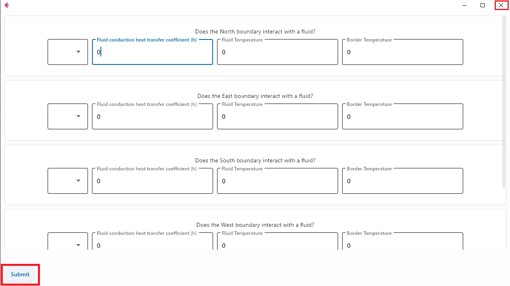
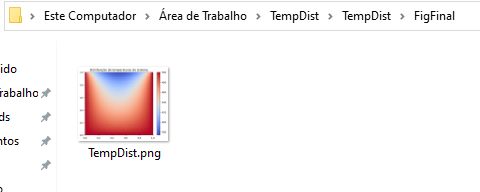
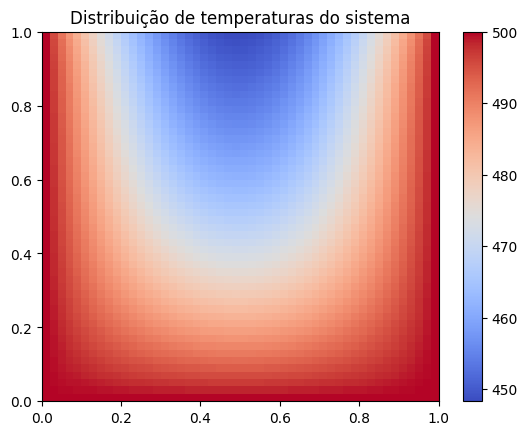
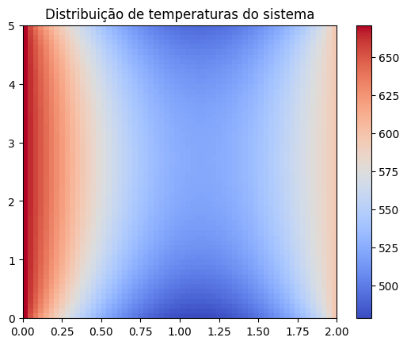

 <i>TempDist: A Scientific Software For Thermal Simulations</i>
==========================================================
<p style="font-family: monospace;">TempDist is a python-based software that uses the finite-difference method and the Gauss-Seidel's method to find and plot the temperature distribution in a conducting material.</p> 

-------------------------------------------------------------

## <i>Badges</i>


---------------------------------------------------------------

## <i>Contents</i>
<!--ts-->
   * [Installation](#instalacao)
   * [Usage](#como-usar)
      * [Prerequisites](#pre-requisitos)
      * [Files](#local-files)
   * [Suggested Tests](#testes)
<!--te-->

## <i id="instalacao">Installation</i>

<p style="font-family: monospace;">Firt, you must install git in your device. Get the latest version <a href="https://git-scm.com/downloads">here</a> or, in ubuntu/debian, you can open terminal and type the following commands</p>

```powershell
$ apt-get install git
```
<p style="font-family: monospace;">For Ubuntu, this PPA provides the latest stable upstream Git version</p>

```powershell
$ add-apt-repository ppa:git-core/ppa
$ apt update
$ apt install git
```

<p style="font-family: monospace;">
In a folder on your device, open powershell/terminal and type the following command:</p>

```powershell
$ git clone https://www.github.com/iluminnatti/TempDist.git
```

<p style="font-family: monospace;">Once the files have been downloaded, you must install python and the python libraries used in this project. Get python <a href="https://www.python.org/downloads/">here</a> for Widows. For ubuntu, do the following in terminal (OBS: make sure you are logged in as a <a href="https://linuxize.com/post/how-to-create-a-sudo-user-on-ubuntu/">user with sudo privileges</a>):</p>

```powershell
$ sudo apt update 
#Update your local system's repository list
$ sudo apt install python3 
#Download the latest version of Python:
$ sudo apt install python3-pip
#install pip3 to manage libraries
```

<p style="font-family: monospace;">
Look in your editor for the python library download tool and install:</p>

+ numpy
+ matplotlib
+ flet

<p style="font-family: monospace;">In ubuntu, you can do the following:</p>

```powershell
$ pip install numpy
#installs numpy
$ pip install matplotlib
#installs matplotlib
$ pip install flet
#installs flet
```

<p style="font-family: monospace;">After this, TempDist is ready to work.</p>

<hr>

## <i id="como-usar">Usage</i>

<p style="font-family: monospace;">The root of TempDist is the main.py file. Execute it in your code interpreter. </p>
<p style="font-family: monospace;">
Once executed, it will open a user interface, in which the user can enter the simulation boundary conditions.</p> 



<p style="font-family: monospace;">Fill in <strong style="color: rgb(188, 36, 60);">all</strong> the fields, click the `submit` button and then close the window, as shown in the image.</p>

<p style="font-family: monospace;">
When sending the data and closing the window, the software will operate the data and, finally, return the plotted graph of the temperature distribution of the analyzed system on the folder "FigFinal", as in the following.</p> 




-----------------------------------------------------

## ° <i id="pre-requisitos">Prerequisites</i>

<p style="font-family: monospace;">TempDist demands the following:</p>


+ <p style="font-family: monospace;">Python 3 (made in v3.10.6)</p>
+ <p style="font-family: monospace;">Numpy</p>
+ <p style="font-family: monospace;">Matplotlib</p>
+ <p style="font-family: monospace;">Flet</p>
+ <p style="font-family: monospace;">Sys (standart)</p>
+ <p style="font-family: monospace;">Pickle (standart)</p>
+ <p style="font-family: monospace;">Time (standart)</p>
---------------------------------------------------------
## ° <i id="local-files"> Files </i>

<p style="font-family: monospace;">The role of each file in TempDist is descibed below.</p>

> <p style="font-family: monospace;"><i style="font-weight: bold; color: rgb(85, 180, 176);">MeshF.py</i>: Responsible for generating the nodal network, dividing the conductor dimensions into an nxn nodal mesh and generating the coordinate matrix of the nodes. In addition, it is also responsible for identifying neighboring nodes to a given node given as a parameter, also identifying which of them are on any of the borders and on which of the borders it is located. The scientific library for Python Numpy is used for this module. In addition, an object-oriented system works here to define the “mesh” class that represents the field of nodes, which has attributes that identify the number of nodes, the dimensions of the network, etc.</p>

> <p style="font-family: monospace;"><i style="font-weight: bold; color: rgb(195, 68, 122);">plots.py</i>: Responsible, since we already have the final temperature matrix for each node, for building the temperature field graph using the scientific library for Python Matplotlib and the Numpy library for organizing the base data.</p>

> <p style="font-family: monospace;"><i style="font-weight: bold; color: rgb(91, 94, 166);">interface.py</i>: Responsible for receiving input data. It is necessary to insert the boundary conditions of the system and the dimensions/characteristics of the conductor, which will be key to obtain the temperature distribution. Therefore, such a module is responsible for data entry, using the `flet` module, wich enables to easily build realtime web, mobile and desktop apps in Python. You can find more <a href="https://flet.dev/">here.</a></p>

> <p style="font-family: monospace;"><i style="font-weight: bold; color: rgb(221, 65, 36);">main.py</i>: As the name says, it is the root of the application, responsible for treating the inserted boundary conditions, applying the finite difference method to identify the coefficients of the matrices related to the phenomenon, and then using the Gauss-Seidel Method to solve the linear equations created from the matrices found.</p>
-----------------------------------------------------------

## <i id="testes">Suggested Tests</i>

<p style="font-family: monospace;">Here are some suggestions of tests, based on real-world data, such as thermal conductivity of some metals, conduction heat transfer coefficient of real fluids, etc.</p>

1. Base case
   + North boundary: 
      + Convective; 
      + Fluid temperature: 300 K (room temperature);
      + Founduction heat transfer coefficient: 5-25 W/m².K (natural convection);
   + East boundary:
      + Conductive; 
      + Temperature: 500 K (~227°C);
   + South boundary:
      + Conductive; 
      + Temperature: 500 K (~227°C);
   + West boundary:
      + Conductive; 
      + Temperature: 500 K (~227°C);
   + Thermal conductivity: 69.4-54.7 W/m.K(iron at 500 K);
   + Conductor Dimensions: 1m x 1m;
   + Mesh size: 50 x 50;

>Result:


2. Two convective borders
   + North boundary: 
      + Convective; 
      + Fluid temperature: 327 K (~54°C);
      + Founduction heat transfer coefficient: 5-25 W/m².K (natural convection);
   + East boundary:
      + Conductive; 
      + Temperature: 594 K (~321°C);
   + South boundary:
      + Convective; 
      + Fluid temperature: 297 K (~24°C);
      + Founduction heat transfer coefficient: 5-25 W/m².K (natural convection);
   + West boundary:
      + Conductive; 
      + Temperature: 671 K (~398°C);
   + Thermal conductivity: 33-36 W/m.K(Steel - Carbon 1.5% C at nearly 673 K);
   + Conductor Dimensions: 2m x 5m;
   + Mesh size: 60 x 60;

>Result:


------------------------------------------------------
## <i> Author </i>

<p style="font-family: monospace;">
This entire project was made by myself, Marcos Túlio Barbosa Abreu, Physics student at UFMG, Minas Gerais, Brazil. If you want to contact me, here are my social media and emails. </p>

[](mailto:marcostuliobarbosaabreu112@gmail.com)
&label=%40mtulio_abreu&logo=instagram&logoColor=white&style=flat-square&url=https://www.instagram.com/mtulio_abreu)
